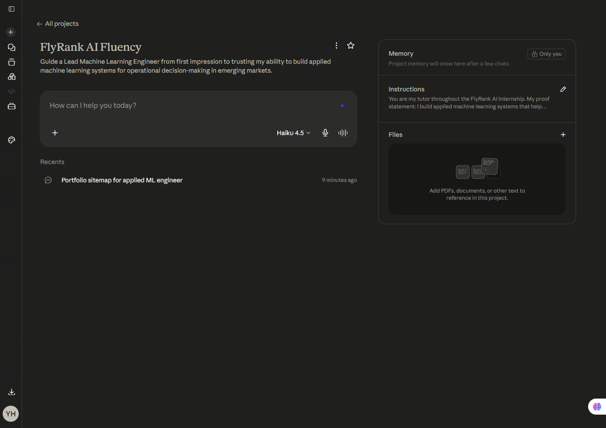
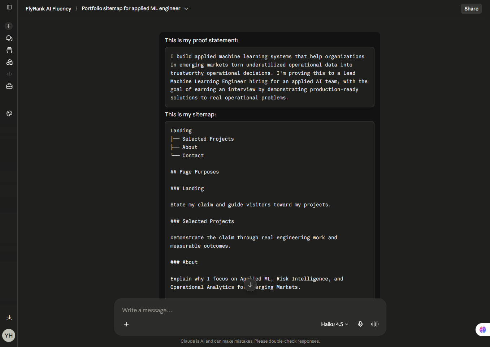
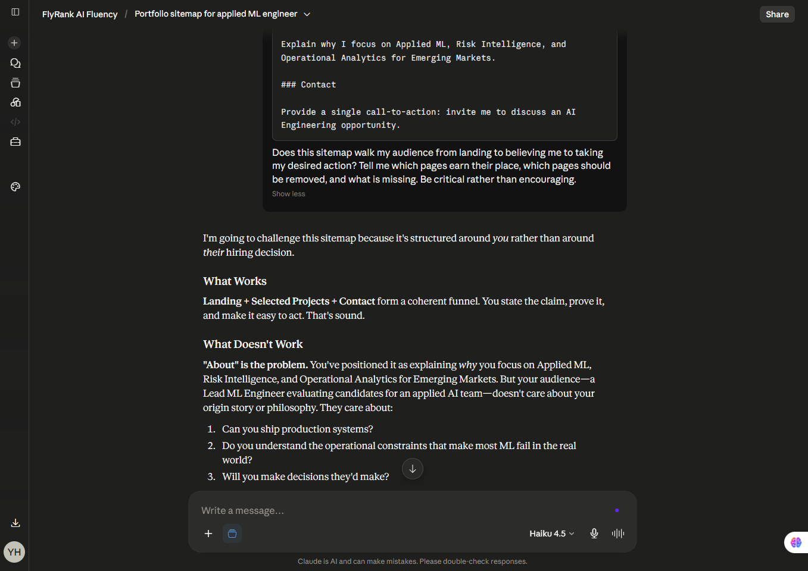
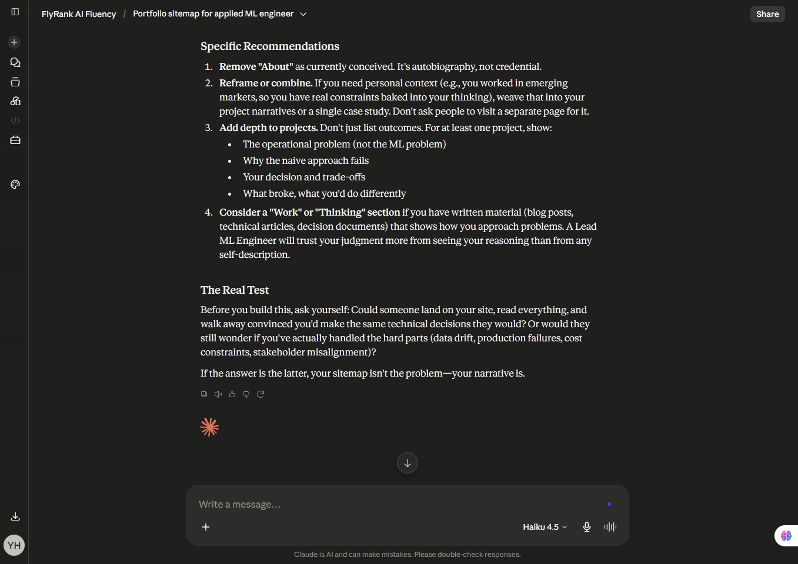

# Portfolio Sitemap

## Goal

Guide a Lead Machine Learning Engineer from first impression to trusting my ability to build applied machine learning systems for operational decision-making in emerging markets.

## Sitemap
```
Landing
├── Selected Projects
├── About
└── Contact
```

## Page Purposes

### Landing

State my claim and guide visitors toward my projects.

### Selected Projects

Demonstrate the claim through real engineering work and measurable outcomes.

### About

Explain why I focus on Applied ML, Risk Intelligence, and Operational Analytics for Emerging Markets.

### Contact

Provide a single call-to-action: invite me to discuss an AI Engineering opportunity.

## Configured Claude Projects


## AI Pressure Test
Pressure test prompt + output:




## Changes Made

After pressure-testing the sitemap with Claude, I decided to replace the original "About" page with an "Engineering Principles" section.

Instead of focusing on my background or motivations, this section will explain how I approach applied machine learning in real-world operational settings. My goal is to demonstrate engineering judgment and not just technical skills, through the principles and trade-offs that guide my work.