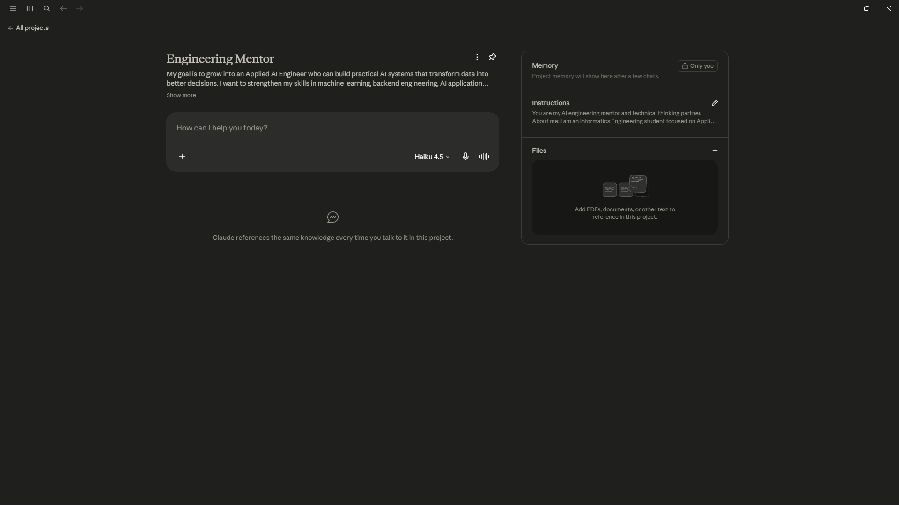
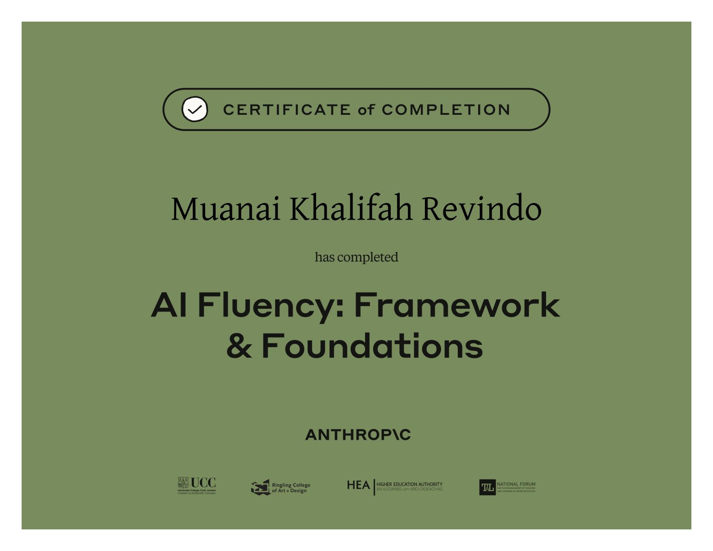

# AI Workflow Audit

## Objective

Audit my recurring engineering workflow to determine where AI should assist, collaborate, automate, or stay out of the process.

## Workflow Audit
| Task                                         | Classification       | Why                                                           |
| -------------------------------------------- | -------------------- | ------------------------------------------------------------- |
| Define system architecture decisions                | Just Me              | Requires engineering judgment and long-term ownership.        |
| Decide which projects belong in my portfolio | Just Me              | AI cannot determine what best represents my career direction. |
| Evaluate ML experiment results                               | Collaborate with AI  | AI helps interpret metrics and identify potential issues, while I validate conclusions.              |
| Debug Python errors                          | Collaborate with AI  | AI accelerates diagnosis but I validate the fix.              |
| Write technical documentation                | Collaborate with AI  | AI improves clarity while I ensure correctness.               |
| Generate unit tests                          | Delegate with Review | AI drafts tests, I verify coverage.                           |
| Refactor Python code                         | Delegate with Review | AI suggests improvements that require validation.             |
| Convert notebook to production script        | Delegate with Review | Mostly mechanical transformation.                             |
| Generate docstrings                          | Delegate with Review | Easy to review after generation.                              |
| Create commit message                        | Fully Automate       | Standard repetitive task.                                     |
| Organize project folders                     | Fully Automate       | Rule-based.                                                   |
| Rename datasets                              | Fully Automate       | No engineering judgment required.                             |

## Three Target Tasks

### Workflow 1: Project Planning & Solution Design

Goal: Transform an idea into a well-defined engineering plan.
Done well means:
- Clear problem statement.
- Success metrics are defined.
- Multiple solution options are evaluated.
- Final architecture is justified by documented trade-offs.

### Workflow 2: AI-assisted Software Development
Goal: Develop reliable backend or ML features with AI assistance while maintaining code quality.
Done well means:
- Code meets functional requirements.
- AI-generated code is reviewed before merging.
- Unit tests pass.
- Changes follow project coding standards.

### Workflow 3: Technical Documentation & Portfolio Writing
Goal: Produce documentation that is accurate, understandable, and useful for both engineers and recruiters.
Done well means:
- Documentation accurately reflects the implementation.
- Project impact and engineering decisions are clearly explained.
- Minimal manual editing is required after the AI-generated draft.
- Documentation remains consistent with the repository structure.

## AI Toolkit Setup

Configured tools:
- ChatGPT
- Claude
- Anthropic Academy

## Claude Project

## Anthropic Academy

Completed:

- AI Fluency: Framework & Foundations

## Reflection

- This audit helped me better understand that AI is most valuable when used as a collaborator rather than a replacement for engineering judgment.
- I found that AI can significantly improve my workflow in areas such as exploring solutions, writing documentation, debugging, and improving code quality. However, decisions involving problem definition, system architecture, and technical trade-offs should remain human-led because they require context and ownership.
- Going forward, I will focus on using AI to accelerate execution while maintaining responsibility for the quality, reliability, and impact of the final outcome.