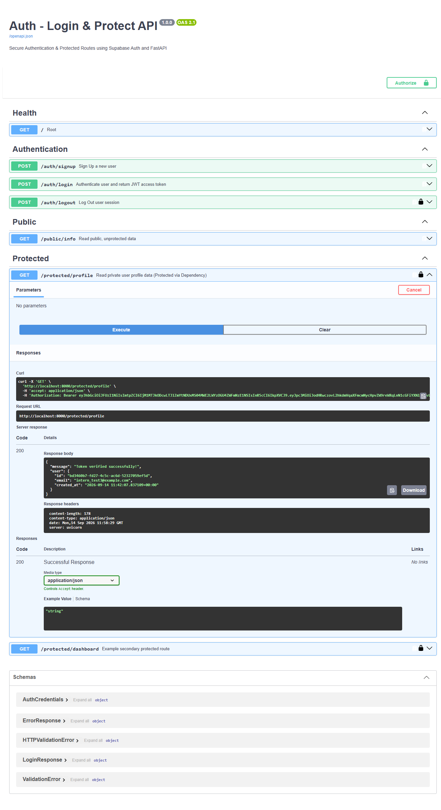

# Auth - Login & Protect (FastAPI + Supabase)

This project demonstrates a fully secure REST API built with **FastAPI** and **Supabase Auth** as the Identity Provider (IdP). It covers user registration, authentication (JWT), token verification, and route protection using middleware/dependencies.

## Features
- **Stateless Authentication**: Uses JWT (JSON Web Tokens) verified directly via Supabase.
- **Protected Routes**: Middleware dependencies to block unauthorized requests (`401 Unauthorized`).
- **Input Validation**: Strict request payload validation rejecting malformed inputs with `400 Bad Request`.
- **Interactive Documentation**: Swagger UI integrated with HTTP Bearer Auth.

## Prerequisites
- Python 3.12+ (managed via `uv`)
- A Supabase Project ([supabase.com](https://supabase.com))

## Setup Instructions

1. **Clone & Navigate**
   ```bash
   git clone <your-repo-url>
   cd week-04/01-auth-login-protect
   ```

2. **Environment Variables**
   Copy the example environment file and fill in your Supabase credentials:
   ```bash
   cp .env.example .env
   ```
   Edit `.env` to include your Supabase **Project URL** and **anon public key**. *(Make sure "Confirm email" is turned off in your Supabase Auth Providers settings for testing).*

3. **Install Dependencies** (using `uv`)
   ```bash
   uv sync
   ```

4. **Run the Server**
   ```bash
   uv run uvicorn main:app --reload --port 8000
   ```
   The API will be available at: `http://localhost:8000`

## API Reference

| Method | Endpoint | Description | Auth Required |
| --- | --- | --- | --- |
| `POST` | `/auth/signup` | Create a new user account | No |
| `POST` | `/auth/login` | Authenticate & receive JWT | No |
| `POST` | `/auth/logout` | Invalidate current session | Yes (Bearer) |
| `GET` | `/public/info` | Access open/public data | No |
| `GET` | `/protected/profile`| Read private user metadata | Yes (Bearer) |
| `GET` | `/protected/dashboard`| Example protected route | Yes (Bearer) |

### Status Codes Explained
- `200 OK`: Request succeeded (e.g., successful login or data read).
- `201 Created`: Resource successfully created (e.g., user signup).
- `204 No Content`: Action succeeded but no data is returned (e.g., logout).
- `400 Bad Request`: Missing fields or validation errors from Supabase.
- `401 Unauthorized`: "I don't know who you are." (Missing, invalid, or expired JWT).
- `403 Forbidden`: "I know who you are, but you lack permissions." (Useful for Role-Based Access Control).

## Swagger UI Documentation

FastAPI automatically generates interactive API documentation. Navigate to `http://localhost:8000/docs` to use the Swagger UI.

1. Click the **Authorize** padlock button.
2. Paste your JWT access token (obtained from `/auth/login`).
3. Click **Try it out** on any protected route.



## Testing with PowerShell

If testing locally via PowerShell, bypass `curl.exe` quoting issues by using `Invoke-RestMethod`:

```powershell
# 1. Login
$res = Invoke-RestMethod -Method POST -Uri "http://localhost:8000/auth/login" -Headers @{"Content-Type"="application/json"} -Body '{"email":"your_email@example.com", "password":"password123"}'
$token = $res.access_token

# 2. Access Protected Route
Invoke-RestMethod -Method GET -Uri "http://localhost:8000/protected/profile" -Headers @{"Authorization"="Bearer $token"}
```
